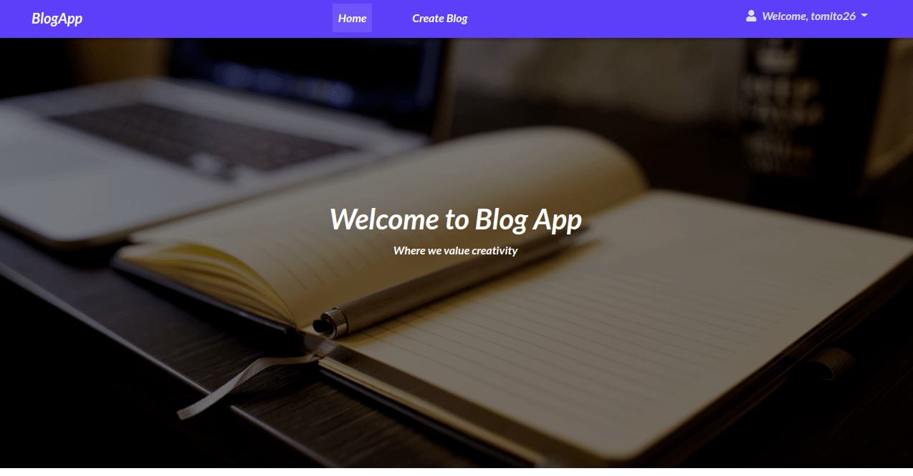

# Blog App
This is  a [blogapp](https://blogapp97.herokuapp.com/) where users post their blogs,read other people's  blog and also  comment on them.For the user to perform such functions he or she must first  create an account and  login.Once the user logins in he or she can update their profile and create their own bio.



## Author
Thomas Khaemba
## Features
* The app has a navigation bar for easier  navigation across the webpage
* On the navbar we have a signin link which is used for login and registration
* Once the user logins in he or she cann create a profile and upload a pic
* The home page has quote section and also an input field where the user can subscribe
* The homepage has linked blogs which when clicked takes the user to different page with specific blog clicked
* The blog page has buttons for updating, and deleting the blog
* The  page of the blog has comment section where other users can comment
* The create blog on the navbar takes the user to a different page where  we have input field for creating blog posts
* 
## Project SetUp
For  one to access this project he or she must first install python to the machine and pip.For linux users they can run the following command

* Python
* pip

After installing python ,you follow the above steps.First copy the project link or  download it.If dowloaded you can unzip by right clicking and a menu bar will appear  and seklect either extract here or extract to a different folder.Else if copied the repo link follow the steps below.

You paste the repo afterb wring the following git command
```
$ git clone<repo>
```
You then go to the directory of the project you just installed
```
$ cd <project-directory>
```
after getting into the project directory you open the IDE using '[code .]()' for vscode and '[atom .]()' for atom IDE
```
$ code ./atom .
```
after opening the terminal you need to create a virtual environment where you will store all your dependancies
you can install it using the following command:
```
$ pip3 install virtualenv
```
and to write the following command
````
$ source name-of-virtual-env/bin/activate
````
After activating it we need to install all the dependancies required for the website to run you can do this by:
````
$ pip freeze -r requirements.txt
````
After installing the dependancies you need to setup a data base on your terminal you can follow these [steps](https://www.digitalocean.com/community/tutorials/how-to-install-postgresql-on-ubuntu-20-04-quickstart)

After installing the database you need  to set the database url on the start.sh file together with your email account,andpassword and generate a secret key for the wtforms
```
export MAIL_USERNAME=<your email>
export MAIL_PASSWORD=<your email password>
export SECRET_KEY=<your wtf forms secret key>
export DATABASE_URL=<database url>
```
after setting up these commands you need to run the final command on the terminal :
```
$ chmod a+x start.sh
```
you can now open the website on your terminal using this command
```
$ ./start.sh
```
and there you have the project
## Technologies Used
* HTML
* CSS3
* Python
* Flask
* Postgresql
* Bootstrap
##  Contribution
If you would like to collaborate or participate on the project you can simply fork the project and run the  above commands

## Support Contacts Details
If you run into any issue or have a questuin concerning the project feel free to reach out on tommybwah@gmail.com
## License and Corporation
Licensed under [Mit license](license)
